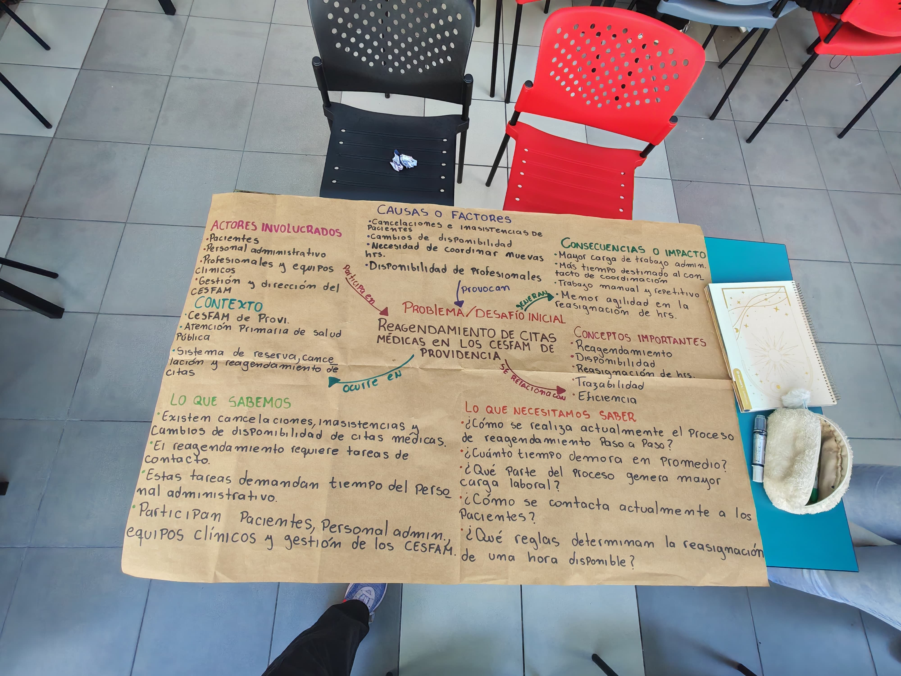
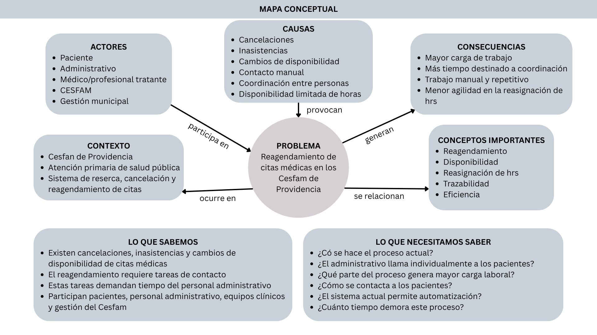
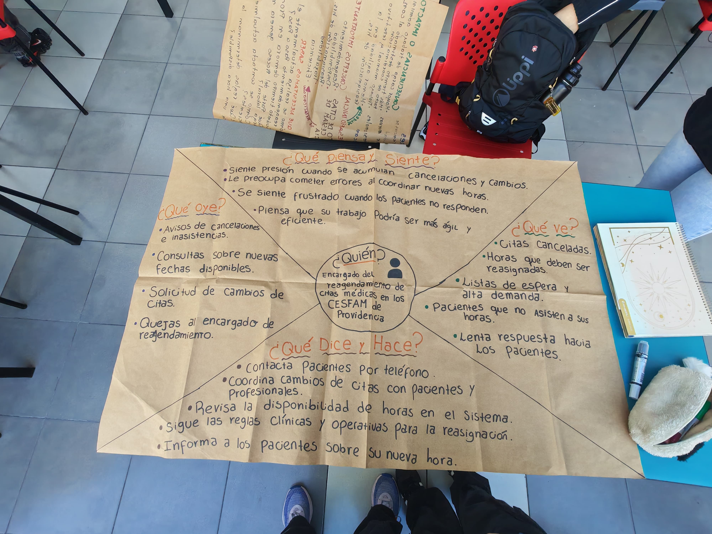
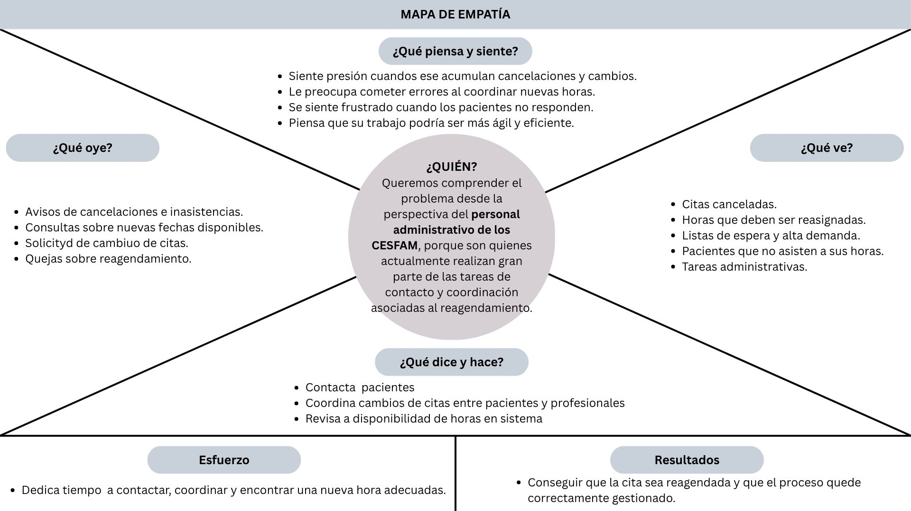

# Clase 03: Comprensión del Problema y Desafío

## 1. Mapa Conceptual del Desafío

  
  

* **Problema Central:** Reagendamiento, inasistencias y gestión de citas médicas en el CESFAM Providencia.
* **Actores:** Pacientes (foco en adultos mayores y de alto riesgo), personal administrativo, médicos/profesionales tratantes, CESFAM y gestión municipal.
* **Causas:** Cancelaciones, inasistencias sin aviso, cambios de disponibilidad, contacto manual, coordinación entre personas y disponibilidad limitada de horas.
* **Consecuencias:** Mayor carga de trabajo, más tiempo destinado a coordinación, trabajo manual/repetitivo y menor agilidad en la reasignación.
* **Conceptos Clave:** Reagendamiento, disponibilidad, reasignación de horas, trazabilidad y eficiencia.

### Declaración del Desafío del Proyecto
* **Verbo:** Automatizar.
* **¿Qué?:** La reducción del tiempo de trabajo manual dedicado al reagendamiento y reasignación de citas médicas de pacientes en los CESFAM de Providencia.
* **¿Cómo?:** A través de un prototipo digital (automatizado o semiautomatizado) desacoplado de sistemas clínicos reales, integrando mapas de proceso, tableros de indicadores y software sin costo de licencias.
* **¿Cuándo?:** Durante el desarrollo del Curso Capstone Intermedio 2026.

---

## 2. Preguntas Abiertas (Derivadas de las dudas iniciales)
A partir del mapa conceptual y lo que necesitábamos saber antes de la visita en terreno, se formularon las siguientes preguntas abiertas para guiar la investigación:

1. ¿Cómo se ejecuta actualmente el proceso de reserva, cancelación y reagendamiento de citas dentro del CESFAM?
2. ¿El personal administrativo llama de forma individual a cada paciente para reagendar o existen canales masivos?
3. ¿Qué etapa específica del proceso administrativo genera la mayor carga de trabajo y congestión?
4. ¿De qué forma se gestiona la inasistencia de pacientes recurrentes o de controles continuos (pacientes de alto riesgo)?
5. ¿El sistema computacional actual permite la integración de herramientas automáticas como tótems o filtros de inteligencia artificial?
6. ¿Cuánto tiempo diario dedica el personal a tareas repetitivas de recepción en comparación con el reagendamiento?

---

## 3. Mapa de Empatía

  
  

* **¿A quién empatizamos?:** Personal administrativo del CESFAM Providencia (encargados de las tareas de contacto, coordinación e ingreso de usuarios).
* **¿Qué piensa y siente?:** Siente presión cuando se acumulan tareas manuales. Le preocupa cometer errores al derivar o coordinar horas. Se frustra cuando los pacientes faltan sin avisar, pero piensa que su trabajo podría ser más eficiente con la tecnología adecuada.
* **¿Qué oye?:** Explicaciones de inasistencias por motivos de salud o personales, consultas por fechas disponibles y preferencia de los adultos mayores por la atención presencial.
* **¿Qué ve?:** Filas de pacientes en recepción para registrarse, cupos médicos perdiéndose por inasistencia e intentos de uso de tótems no integrados.
* **¿Qué dice y hace?:** Atiende al público presencialmente, realiza llamadas de "rescate" a pacientes de alto riesgo y revisa disponibilidad en el sistema.
* **Esfuerzos:** Invertir entre un 60% y 70% de la jornada diaria registrando manualmente a los pacientes que llegan y filtrando antecedentes clínicos a mano.
* **Resultados:** Lograr que los pacientes acudan a sus controles y que las horas médicas sean optimizadas.

---

## 4. Identificación de Supuestos y Evidencias

| Supuesto Inicial / "Lo que creíamos" | Evidencia Obtenida en Terreno (Respuesta CESFAM) | Estado del Supuesto |
| :--- | :--- | :--- |
| **Supuesto 1:** El reagendamiento telefónico manual es la tarea que genera la mayor sobrecarga de trabajo. | La funcionaria aclaró que el reagendamiento por web/teléfono no es engorroso y ya cuenta con avisos por WhatsApp y grabadoras. La mayor carga (**60% a 70% del tiempo**) es el **registro manual de llegada de usuarios**. | **Falso parcialmente** (Se reenfoca la prioridad del problema). |
| **Supuesto 2:** Los pacientes llaman formalmente para cancelar sus citas con anticipación. | La mayoría no avisa ni cancela por iniciativa propia; simplemente no asisten a la hora asignada. | **Falso** (El problema real es el ausentismo no notificado). |
| **Supuesto 3:** Se requiere un seguimiento especial para pacientes con controles continuos. | Para pacientes de **alto riesgo** que faltan a sus exámenes/controles, se realiza un seguimiento activo ("rescate") llamándoles repetidamente hasta lograr que asistan. | **Verdadero** |
| **Supuesto 4:** El filtro para asignar la especialidad médica adecuada se realiza de forma automática. | El filtro debe ser revisado manualmente por profesionales/administrativos, lo que a veces deriva en asignaciones incorrectas de horas (ej: médico general en vez de nutriólogo). | **Falso** (Existe oportunidad de automatizar el filtro médico). |

---

## 5. Fotografías y Respuestas (Evidencia de Visita en Terreno)
* **Fecha de la visita:** Viernes 4 de septiembre de 2026, 14:00 hrs.
* **Lugar:** CESFAM Providencia.
* **Documento de Entrevista:** *(Consultar PDF subido al repositorio: `Preguntas administración CESFAM.pdf`)*.

### Registro Fotográfico de la Investigación:

### Resumen de Respuestas Clave del Personal:
1. **Procedimiento de Reagendamiento:** Existen 3 vías (presencial, web y telefónica). Si es adulto mayor, el personal lo gestiona directamente.
2. **Herramientas Existentes:** Cuentan con recordatorios automáticos por WhatsApp, llamadas grabadas y una plataforma web implementada hace un año que ha dado buenos resultados.
3. **Propuesta del Personal para Mejorar:** 
   * Automatizar el registro de entrada con **tótems integrados** que lean el carnet e impriman un ticket indicando el box y piso exacto (liberaría el 60-70% de su tiempo).
   * Implementar un **filtro inteligente/IA** que lea el historial médico del usuario al pedir hora para no asignarle un especialista equivocado.

---

## 6. Estrategia y Reflexión Oral (Preparación del Pitch Hito 1)

### Estrategia de Presentación (Pitch):
* **Enfoque:** La presentación oral se centrará 100% en la **comprensión del problema**, validación de supuestos y contexto del CESFAM Providencia (sin presentar la solución técnica aún).
* **Distribución del Tiempo y Voces:**
  * **Introducción y Contexto (Eduardo):** Presentación del desafío y contexto de atención en el CESFAM Providencia.
  * **Problema y Mapeo (Ian y Vania):** Explicación del flujo actual, mapa conceptual y mapa de empatía del personal administrativo.
  * **Hallazgos en Terreno (María y Daniela):** Exposición de la entrevista del viernes 4 de septiembre, contrastando los supuestos iniciales con la realidad (hallazgo del 60-70% de carga en recepción).
  * **Cierre y Oportunidades (Oscar):** Síntesis de las necesidades no resueltas (tótems de llegada y filtro inteligente de citas) para dar paso a la fase de ideación.

### Reflexión del Equipo:
A través del ejercicio de empatía y la entrevista en terreno, comprendimos que resolver el desafío no implica simplemente crear una app de reagendamiento desde cero, sino **integrar de forma inteligente los sistemas que el CESFAM ya posee** (WhatsApp, web) con la recepción presencial (tótems) para atacar la verdadera sobrecarga administrativa y el ausentismo de pacientes.
