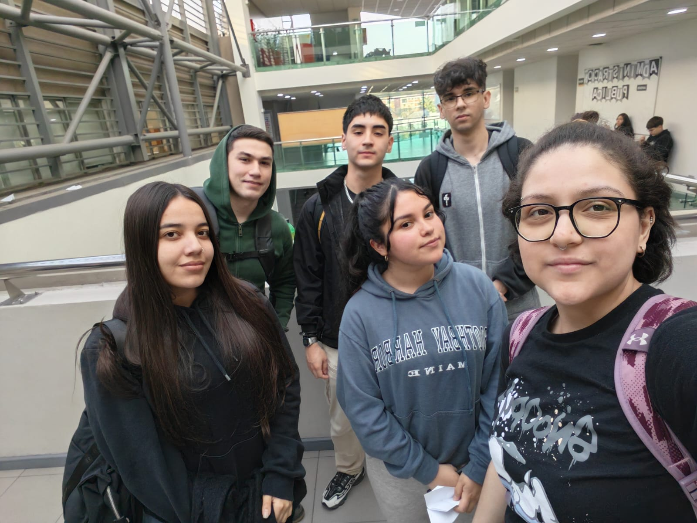

# CAPSTONE-DESAFIO-08-CESFAM
<div align="center">

# 🏥 Proyecto Capstone Intermedio: Automatización del Reagendamiento de Citas Médicas
### **CESFAM Providencia — Desafío N° 8**


<p align="center">
  <b>Unidad 1: Empatizar y Definir</b><br>
  Plataforma y bitácora digital para el desarrollo del proyecto de ingeniería enfocado en la atención primaria de salud pública.
</p>

---

</div>

## 📌 Resumen del Desafío

El **CESFAM Providencia** enfrenta retos operacionales en la gestión de agendamiento, inasistencias y reagendamiento de citas médicas. A través del trabajo en terreno con el personal administrativo y el mapeo de procesos, este proyecto busca identificar cuellos de botella y proponer una solución tecnológica desacoplada, eficiente y accesible que reduzca la carga laboral repetitiva e incremente la tasa de asistencia de los usuarios.

> 🎯 **Declaración del Objetivo del Proyecto:**
> * **Verbo:** Automatizar.
> * **¿Qué?:** La reducción del tiempo de trabajo manual dedicado al reagendamiento y reasignación de citas médicas de pacientes en los CESFAM de Providencia.
> * **¿Cómo?:** A través de un prototipo digital (automatizado o semiautomatizado) desacoplado de sistemas clínicos reales, integrando mapas de proceso, tableros de indicadores y software sin costo de licencias.
> * **¿Cuándo?:** Durante el desarrollo del Curso Capstone Intermedio 2026.

---

## 👥 Equipo de Trabajo — *[NOMBRE GRUPO]*

<div align="center">

| Integrante | Rol en el Proyecto | Compromiso SMART |
| :--- | :--- | :--- |
| **Eduardo Monsalves** | Coordinador General | Supervisar el avance semanal y asegurar el 100% de entregas a tiempo en GitHub. |
| **Oscar Díaz** | --- | --- |
| **Daniela Pizarro** | --- | --- |
| **María Bustamante** | --- | --- |
| **Ian Olivares** | --- | --- |
| **Vania Cuicui** | --- | --- |

</div>

<br>

<div align="center">
  
  <br>
  <i>Figura 1: Equipo de Trabajo InnovaSalud - Semestre Primavera 2026.</i>
</div>

---

## 📂 Estructura de la Bitácora y Entregables

A continuación se explica de forma general la navegación por el contenido de este repositorio.

```bash
.
├── README.md                           # Portada principal y presentación del proyecto
├── anexos/                             # Documentos relevantes
└── imagenes/                           # Registros fotográficos y diagramas
